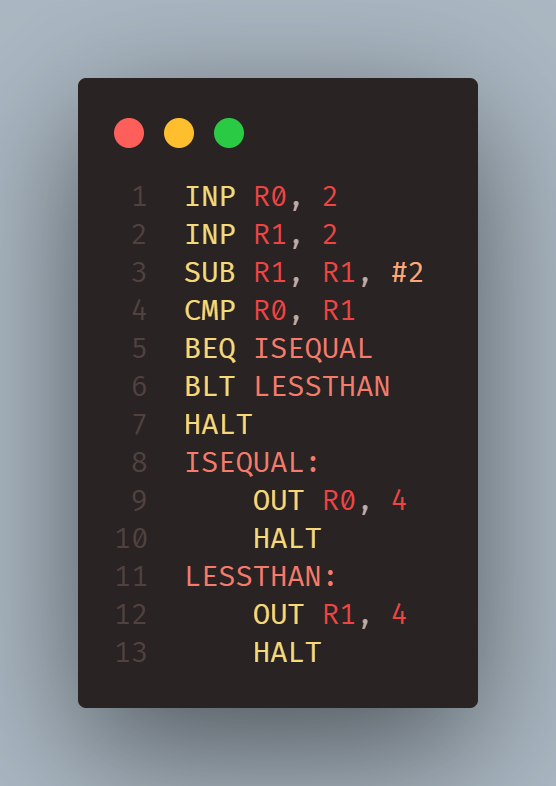

# AQA Assembly (ASM)
Syntax Highlighting for the AQA Assembly Instruction set

## Features
Works on .asm, .as and .a files 
Keyword highlighting (ADD, SUB, CMP etc) 
Branches, registers and numbers as well

(With Bearded Coffee Theme) 
</img>

## Releases
### 1.0.0 (8/7/25)
Initial release
### 1.0.1 (8/7/25)
Fixed bug with branch names
### 1.0.2 (8/7/25)
Changed display name
Updated readme
### 1.0.3 (9/7/25)
Added comment colouring